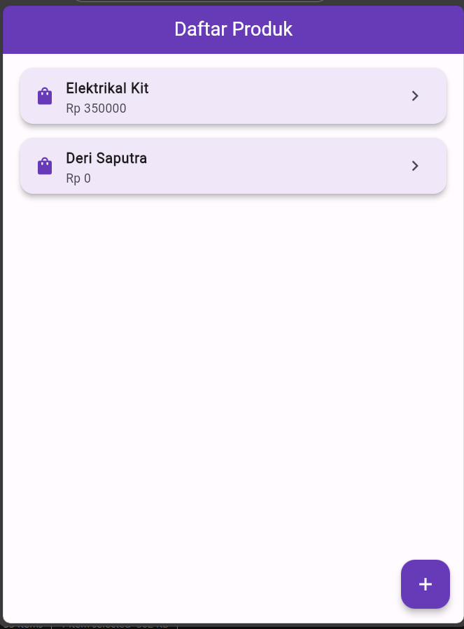
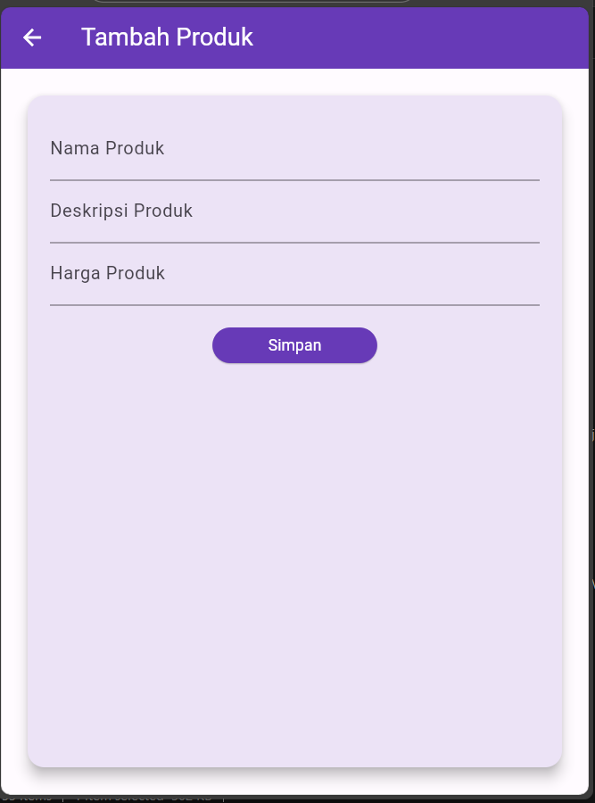
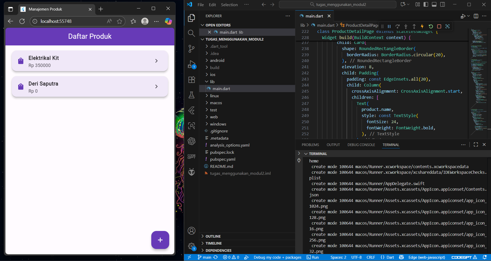

# 📱 Manajemen Produk - Flutter

Aplikasi sederhana berbasis **Flutter** untuk menampilkan daftar produk, menambah produk baru, dan melihat detail produk.

---

## 🚀 Fitur Utama
- Tambah produk dengan nama, deskripsi, dan harga  
- Tampilkan daftar produk yang sudah ditambahkan  
- Lihat detail produk secara lengkap  
- Desain menggunakan **Material 3** dan tema **Deep Purple**

---

## 💻 Tampilan Program
| Daftar Produk | Tambah Produk | Preview Code |
|----------------|----------------|----------------|
|  |  |  |

> Simpan screenshot hasil aplikasi di folder `screenshots/`.

---

## ⚙️ Cara Menjalankan
```bash
flutter pub get
flutter run


